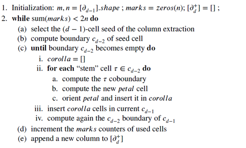

# Algoritmo Topological Gift Wrapping - TGW

L'algoritmo TGW è descritto in questa sezione, generalizzandolo per lo 
spazio $d-dimensionale$. L'input è la matrice sparsa [$\delta_{d-1}$],  
l'output è la matrice [$\delta_d^+$], dalla d-catena al (d-1)-ciclo  
orientato.

