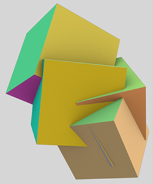
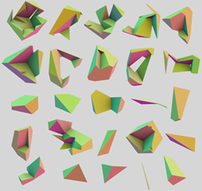

## Catene e Disposizioni

La parola arrangment è usata nella geometria combinatoria e  
computazionale, ma anche nella topologia, come sinonimo di partizione  
spaziale.\
\
*Definizione Space Arrangement*: Data una collezione finita $S$ di  
oggetti geometrici in $E^d$ la disposizione $A(S)$ è la decomposizione  
di $E^d$ in celle connesse di dimensione $0, 1,…,d$ indotte da $S$.  
Siamo interessati alla partizione dello spazio euclideo indotta da una  
collezione di complessi cellulari PL.\
Data una collezione $S$ di oggetti geometrici, un nuovo metodo per  
calcolare la topologia della loro disposizione spaziale consiste nel  
valutare $A(S)$ come complesso di catene $C$.\
Esempio di 3D arrangment\

 

Nelle figure si mostra la disposizione $A(S)$ generata dalla collezione  
$S$ fatta dalle trenta facce 2D di 5 cubi che si intersecano  
randomicamente. Ogni cella 3D in $A(S)$ è generata da una colonna  
della matrice sparsa della mappa di confine confine $\delta_3$ con  
valori in $(0,1,-1)$. Nella figura a sinistra si nota la collezione $S$ di  
5 cubi randomici in $E^3$, mentre quella di destra mostra le 3-celle  
generate in $E^3$ dalla disposizione $A(S)$, (non in scala, e  
opportunamente ruotate per mostrare meglio la loro forma complessa). Si  
noti che alcune celle contengono buchi.
Le colonne di $\delta_3$ sono 2-cicli, cioè catene chiuse in $C2$. In  
particolare, si mostra che le 3-catene sono atomi irriducibili  
dell'algebra CSG con celle chiuse e regolari. Inoltre, potrebbero essere  
non convesse ed avere buchi. La cella esterna è il complemento della  
loro unione. Qualsiasi modello geometrico dell'algebra booleana CSG  
generata da questi cinque cubi è composto da un sottoinsieme di quei 25  
atomi.