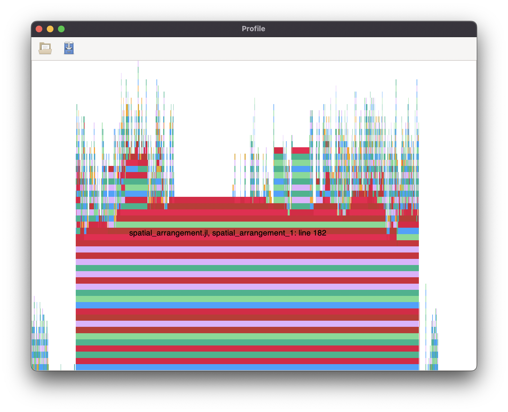
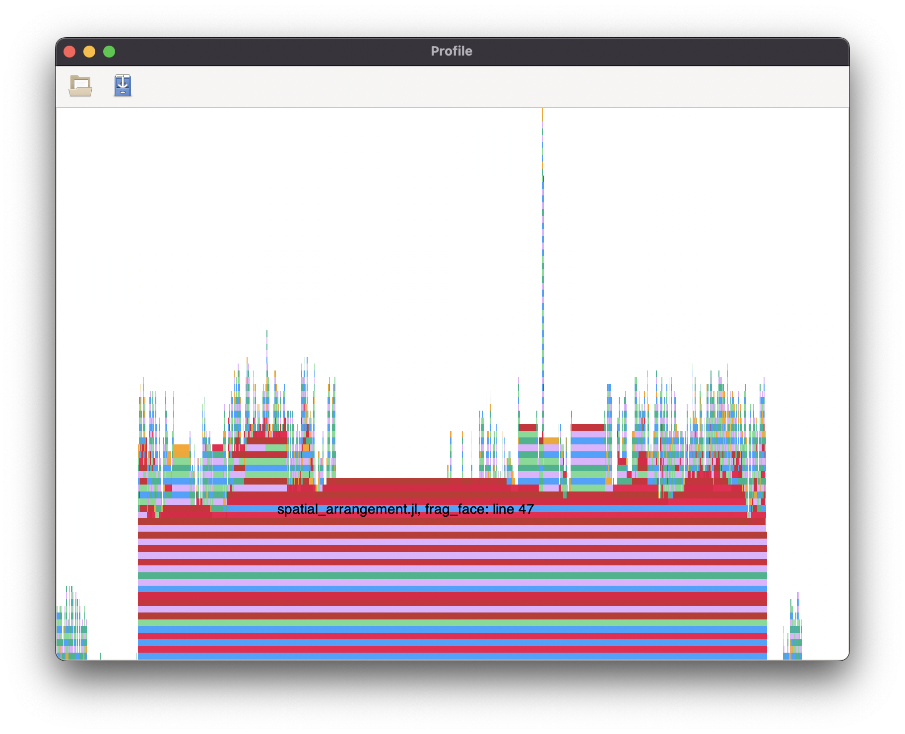
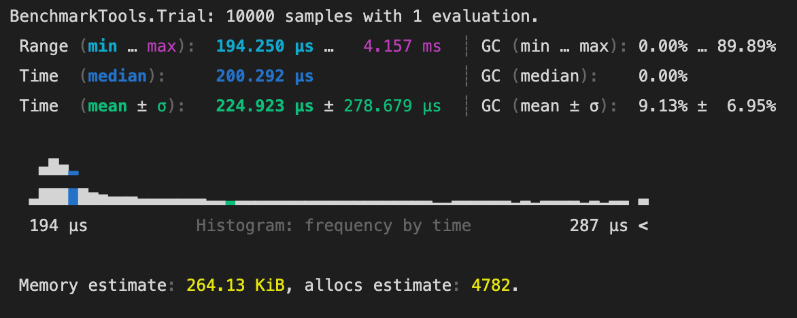
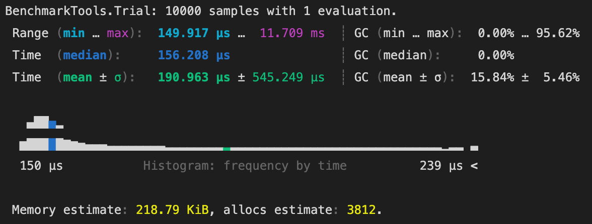
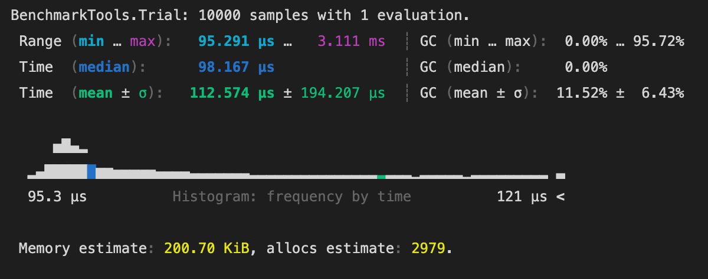
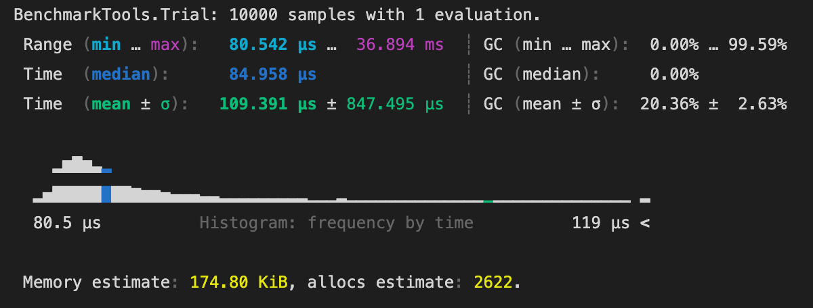
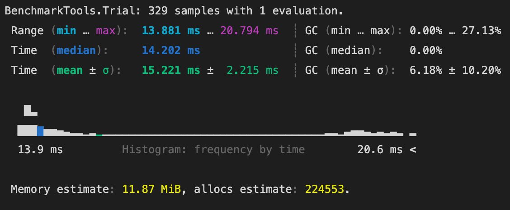
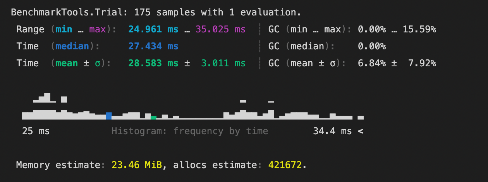
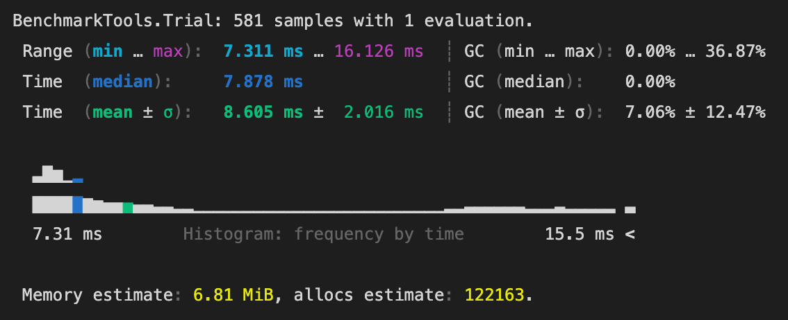

## Prestazioni
Con l'aiuto della libreria `Profile` è possibile
visualizzare a schermo un riferimento grafico relativo ai
tempi di esecuzione.

L'asse orizzontale, nel grafico prodotto, rappresenta la quantità di tempo (più precisamente, il numero di backtraces) 
speso su ogni riga, è quindi sensato focalizzare l'attenzione sulle righe relative alle barre più lunghe.

Di seguito il grafico prodotto da `Profile` per il metodo `spatial_arrangement`.



Si vede come la riga più in basso, quindi anche quella in cui il 
processo rimane fermo più tempo è relativa a `spatial_arrangement_1`.

Applichiamo quindi `Profile` a `spatial_arrangement_1` ottenendo il seguente
grafico.




> Il metodo `spatial_arrangement_1` presenta già una parallelizzazione che sfrutta
> un numero di Threads superiore ad 1. 

La funzione su cui focalizzarsi risulta essere quindi `frag_face`.

Nel notebook  [frag_face_parallelized.ipynb](https://github.com/not-Karot/TopologicalGiftWrapping8A/blob/main/notebooks/frag_face_parallelized.ipynb)
ci occuppiamo quindi di migliorare le prestazioni di questo metodo con un risultato
di riduzione spaziale e temporale di quasi il 20%, come mostrato dai seguenti benchmarks.


```julia
V, EV, FE = get_input()
@benchmark Lar.Arrangement.frag_face(Lar.Points(V),EV,FE,[2,3,4,5],2)
```



```julia
V, EV, FE = get_input()
@benchmark frag_face_async(Lar.Points(V),EV,FE,[2,3,4,5],2)
```



La parallelizzazione prosegue nel notebook [merge_vertices_parallelized.ipynb](https://github.com/not-Karot/TopologicalGiftWrapping8A/blob/main/notebooks/merge_vertices_parallelized.ipynb)
con i miglioramenti evidenziati dai successivi benchmarks.

```julia
V, EV, FE = get_input()
@benchmark Lar.Arrangement.merge_vertices($Lar.Points(V),$Lar.ChainOp(EV),$Lar.ChainOp(FE),$1e-8)
```



```julia
V, EV, FE = get_input()
@benchmark merge_vertices_async(Lar.Points(V),Lar.ChainOp(EV),Lar.ChainOp(FE),1e-8)
```




Inserendo le funzioni parallelizzate nel metodo `spatial_arrangement_1`,
i risultati diventano significativi, come mostrato dalle seguenti figure.
> [spatial_arrangement_1.ipynb](https://github.com/not-Karot/TopologicalGiftWrapping8A/blob/main/notebooks/spatial_arrangement_1)

```julia
V, EV, FE = get_input()
@benchmark Lar.Arrangement.spatial_arrangement_1(Lar.Points(V),Lar.ChainOp(EV),Lar.ChainOp(FE),false)
```



```julia
V, EV, FE = get_input()
@benchmark spatial_arrangement_1_rev(Lar.Points(V),Lar.ChainOp(EV),Lar.ChainOp(FE)) 
```


Il tempo di esecuzione si riduce quindi del 75%, mentre la memoria allocata di quasi il 60%.

Infine testiamo l'intero processo `spatial_arrangement` ottenendo i seguenti miglioramenti.

> [spatial_arrangement.ipynb](https://github.com/not-Karot/TopologicalGiftWrapping8A/blob/main/notebooks/spatial_arrangement)

```julia
@benchmark Lar.Arrangement.spatial_arrangement(W, cop_EV, cop_FE)
```



```julia
@benchmark TGW.spatial_arrangement(W, cop_EV, cop_FE)
```



>L'esecuzione dell'algoritmo TGW3D risulta essere quindi ridotta di un fattore circa 4, sia per quanto riguarda la memoria che il tempo
> utilizzati.


