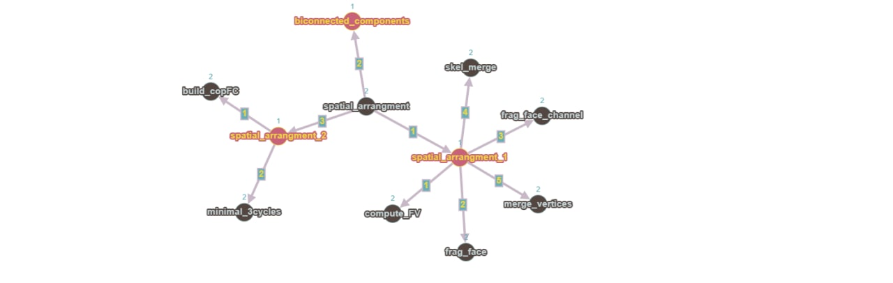

***Magistrale in Ingnegneria Informatica***


Calcolo parallelo e distribuito\
**LAR - Topological gift wrapping in 3D**\
*Gruppo 8a*

| Nome | Matricola | E-mail | Profilo Github |
| --- | --- | --- | --- |
| Ennio Malvati | 484998 | enn.malvati@stud.uniroma3.it | [https://github.com/\](https://github.com/) |
| Gianluca Di Lorenzo | 583630 | gia.dilorenzo1@stud.uniroma3.it | [https://github.com/\](https://github.com/) |
| Raffaele Scarano | 576304 | raf.scarano@stud.uniroma3.it | [https://github.com/](https://github.com/) |


# Introduzione

Il dominio dello schema di rappresentazione è attualmente limitato  
all'Algebra Booleana dei poliedri PL, che possono essere disconnessi e/o  
non-varianti. Gli elementi di questa algebra sono in corrispondenza  
uno-ad-uno, biunivoca, con le 3-chains complexes, ossia i complessi di  
catene di 3 dimensioni, usando le basi p-chains (p-celle, con $p = 0, ... ,3)$ con cui sono connesse.\
Data una qualsiasi raccolta di modelli di questo dominio, utilizzando  
l'approccio di Paoluzzi, costruiamo la rappresentazione LAR della loro  
disposizione in $E^3$, includendo il complesso di tre-catene con  
$\delta_p$ operatori rappresentati da matrici sparse *(si ricordi che le  
matrici sparse sono matrici con molti elementi non significativi).*  
3-cells e le 3-chains elementari in LAR sono in corrispondenza  
uno-ad-uno con gli atomi dell'Algebra Booleana dei CSG . Per cui ogni  
solido 3D in questa algebra booleana può essere rappresentato sia da una  
stringa di bit che ne indica la struttura in termini di atomi, cioè da  
una 3-chains coerentemente orientata, sia dal suo 2-ciclo orientato al  
limite.

# Stato dell'arte

## Complessi di catene e complessi di celle

Un complesso è un insieme $S$ con grado $S = {S _i }$ . Verranno  
utilizzati due tipi di complessi diversi ma intrecciati, in particolare  
complessi cellulari e complessi di catene. Le loro definizioni ed alcuni  
concetti correlati vengono forniti in questa sezione. Le lettere  
greche saranno usate per le celle di uno spazio di partizione e le  
lettere romane per le catene di celle, codificate come numeri  
interi con e senza segno o array sparsi di numeri interi con e senza  
segno.

## Complessi di celle

*Definizione d - Manifold* : un $manifold$ è uno spazio topologico  
che localmente è simile ad un altro spazio topologico ben conosciuto, ad  
esempio lo spazio euclideo n-dimensionale, ma che globalmente può avere  
proprietà geometriche differenti, ad esempio può essere "curvo"  
contrariamente allo spazio euclideo. Ogni punto di un manifold con d  
dimensioni ha un vicino che è omeomorfo, cioè simile ma non  
obbligatoriamente uguale del tutto, ad $E^3$, lo spazio euclidiano di  
d-dimensioni.\
\
*Definizione Cella* : una $p-cella$ è un $p-manifold$ con  
confini 0 $\leq$ p $\leq$ d i quali sono lineari a tratti, connessi,  
possibilmente non convessi e non contrattabili, non si storcono. Questa  
definizione si riferisce ai complessi cellulari di questo lavoro e nella  
nostra rappresentazione ci possono essere celle con buchi interni.\
Avremo a che fare con celle Piecewise-Linear (PL) (lineari a tratti)  
rispettivamente di dimensione 0, 1, 2 e 3. Va notato che le 2-celle e  
3-celle possono contenere dei fori (buchi), pur rimanendo collegati. In  
altre parole, le celle sono poliedri, cioè segmenti, poligoni e poliedri  
incorporati in uno spazio bi o tridimensionale.\
\
*Definizione complesso cellulare*: un $p-complesso$ cellulare è un  
insieme finito di celle che hanno al massimo dimensione $p$, insieme  
alle loro facce $r-dimensionali$ dei bordi con 0 $\leq$ r $\leq$ p. Una  
faccia è un elemento del confine lineare a tratti della cella, il quale  
soddisfa le condizioni di compatibilità di confine, che seguono:
- Due $p-celle$ sono boundary-compatible quando i loro punti di  
  intersezione contengono le stesse r-facce.\
- Un complesso cellulare di dimensione p è definito regolare quando  
  ogni r-cella, con 0\leq r\leqp , è una faccia di una p-cella\
  \
  *Definizione Skeleton*: Un $s-skeleton$ di un $p-complesso$ $\Lambda_p$,  
  con s $\leq$ p, è l'insieme $\Lambda_s$ di tutte le r-celle di $\Lambda_p$. Ogni scheletro di un complesso regolare è un sottocomplesso regolare.\
  \
  *Definizione Rappresentazione Geometrica*: La rappresentazione  
  algebrica lineare (LAR) ha introdotto l'uso di array binari sparsi per  
  calcolare e rappresentare una topologia algebrica di complessi  
  cellulari, ovvero spazi lineari di catene e operatori di (co)confine  
  lineari. (Quindi è una mappatura della disposizione geometrica con  
  matrici/array sparsi binari).\
  \
  *Definizione Spazio di supporto*: Lo spazio di supporto  
  |$\Lambda$| di un complesso cellulare è l'insieme dei punti dell'unione  
  delle proprie celle.\
  Una $p-catena$ può essere vista, forzando il linguaggio, come  
  una collezione di $p-celle$.

## Catene e Disposizioni

La parola arrangment è usata nella geometria combinatoria e  
computazionale, ma anche nella topologia, come sinonimo di partizione  
spaziale.\
\
*Definizione Space Arrangement*: Data una collezione finita $S$ di  
oggetti geometrici in $E^d$ la disposizione $A(S)$ è la decomposizione  
di $E^d$ in celle connesse di dimensione $0, 1,…,d$ indotte da $S$.  
Siamo interessati alla partizione dello spazio euclideo indotta da una  
collezione di complessi cellulari PL.\
Data una collezione $S$ di oggetti geometrici, un nuovo metodo per  
calcolare la topologia della loro disposizione spaziale consiste nel  
valutare $A(S)$ come complesso di catene $C$.\
Esempio di 3D arrangment\


 


Nelle figure si mostra la disposizione $A(S)$ generata dalla collezione  
$S$ fatta dalle trenta facce 2D di 5 cubi che si intersecano  
randomicamente. Ogni cella 3D in $A(S)$ è generata da una colonna  
della matrice sparsa della mappa di confine confine $\delta_3$ con  
valori in $(0,1,-1)$. Nella figura a sinistra si nota la collezione $S$ di  
5 cubi randomici in $E^3$, mentre quella di destra mostra le 3-celle  
generate in $E^3$ dalla disposizione $A(S)$, (non in scala, e  
opportunamente ruotate per mostrare meglio la loro forma complessa). Si  
noti che alcune celle contengono buchi.
Le colonne di $\delta_3$ sono 2-cicli, cioè catene chiuse in $C2$. In  
particolare, si mostra che le 3-catene sono atomi irriducibili  
dell'algebra CSG con celle chiuse e regolari. Inoltre, potrebbero essere  
non convesse ed avere buchi. La cella esterna è il complemento della  
loro unione. Qualsiasi modello geometrico dell'algebra booleana CSG  
generata da questi cinque cubi è composto da un sottoinsieme di quei 25  
atomi.

### Cicli e confini

Due sottospazi altamente utili sono contenuti all'interno di ogni spazio  
$C_p$ delle catene: i sottospazi dei cicli e dei confini. \
\
Definizione Catene, cicli e sottospazi di confine:\
Un $p-ciclo$ è definito come una $p-catena$ senza confine, per cui è un  
elemento del kernel $Z_p$ di $\delta_p$ (gli insiemi rossi della  
figura). Un p-confine (p-boundary) è una p-catena che è il confine di  
una (p+1)-catena, per cui è un elemento dell'immagine $B_p$ di  
$\delta_(p+1)$. L'insieme $B_p$ è un sottoinsieme del kernel di  
$\delta_p$, poiché il confine del confine è vuoto.


**Proprietà** le colonne della matrice $\delta_3^+$ sono 2-cicli.
L'algoritmo che implementeremo, cioè il topological-gift-wrapping  
**TGW** in 3D, produce la matrice sparsa [$\delta_3^+$], proprio  
partendo dalla matrice sparsa [$\delta_2$]. Più in generale, ogni  
colonna delle matrici di confine, è un 2-ciclo.\
**Proprietà** la somma delle righe di $\delta_3$ è zero.

# Calcolo dei confini

Nella maggior parte dei casi, l'ambiente di calcolo geometrico di  
destinazione è in grado di visualizzare, più in generale di gestire, un  
modello solido utilizzando solamente una rappresentazione dei  
confini/bordi, tipicamente usando una triangolazione. È facile ottenere  
una tale rappresentazione moltiplicando la matrice dell'operatore  
3-boundary (bordi a tre dimensioni) $\delta_3 : C_3$ $\longmapsto  
C_2^\circlearrowleft$ per il vettore di coordinate C3 nello spazio  
dell'espressione solida, calcolato come termine binario nel nostro  
insieme algebrico[^1].\
Una volta ottenuta in questo modo la coordinata designata del vettore di  
bordo dell'oggetto solido, cioè la 2-catena formata dalle sue 2-celle  
orientate (le facce), queste devono essere raccolte da colonne in una  
"matrice facciale" sparsa e tradotta nella corrispondente matrice di  
1-cicli orientati di spigoli/edge, per moltiplicazioni destre di  
[$\delta_2$] per la matrice delle facce. I poligoni di  
confine/boundary generati (corrispondenti alle colonne della matrice  
prodotto sparsa) saranno normalmente triangolizzati e infine  
renderizzati dall'hardware grafico o esportati in formati di file  
grafici standard o qualsiasi altro formato geometrico necessario per  
l'applicazione prevista.\
\
*Definizione Complessi Geometrici LAR*: è utile ricordare che per  
mostrare una triangolarizzazione di facce di bordo nella loro propria  
posizione nello spazio, tutte le informazioni geometriche e topologiche  
necessarie sono contenute all'interno di $evaluatedLAR$ o in  
$GeometricComplex$ (GC), data la coppia :


$\mu : C_0 \longmapsto E^3, (\delta_2,\delta_1, \delta_0)  
\equiv V, (CF, FE, EV)$


dove V è di tipo $Matrix-Real$ con tre righe e colonne pari alla  
cardinalità di $C_0$ ed inoltre (CF, FE, EV) sono matrici sparse di  
co-bordi (coboundary). Le coppie ordinate di lettere da V, E, F, C,  
corrispondono alla sequenza coboundary che segue: Vertici → Bordo (edge)  
→ Facce → Celle espresso attraverso l'ordine sinistrorso Colonna → Riga  
di mappe matriciali di operatori.\
\
**Memorizzazione di Complessi Geometrici Lar:** La topologia di un  
3-complesso LAR è completamente rappresentata dagli operatori  
($\delta_2$,$\delta_1$, $\delta_0$) , cioè dagli array sparsi $(CF, FE, EV)$, fornendo le incidenze tra vertici, bordi e facce, sia per b-reps  (rappresentazione geometrica dai bordi) che per rappresentazioni cellulari.

# Algoritmo Topological Gift Wrapping - TGW

L'algoritmo TGW è descritto in questa sezione, generalizzandolo per lo  
spazio $d-dimensionale$. L'input è la matrice sparsa [$\delta_{d-1}$],  
l'output è la matrice [$\delta_d^+$], dalla d-catena al (d-1)-ciclo  
orientato.


# Funzioni del progetto

Dopo un'attenta analisi del repository  
<https://github.com/cvdlab/LinearAlgebraicRepresentation.jl>, abbiamo  
definito il grafo delle dipendenze relativo al progetto a noi assegnato.  
Il risultato della nostra analisi è la seguente:




Si definiranno ora le funzionalità principali della repository utili ai  
fini dell'algoritmo TGW 3D.

La funzione **spatial arrangment** si occupa di partizionare i complessi  
cellulari, presi in input, con scheletro di dimensione 2 in 3D. Ne segue  
che un complesso cellulare è partizionato quando l'intersezione di  
ogni possibile coppia del complesso risulta vuota e l'unione di  
tutte le celle è tutto lo spazio euclideo. L'output della funzione  
consiste nella partizione complessa rappresentata da una lista di  
vertici V e di una catena di bordi EV, FE, CF.\
\
**spatial arrangment 1**: questa funzione frammenta le facce delle  
figure ai fini dell'utilizzo del arrangment planare. A tal fine usa come  
funzioni di supporto **frag face** e **merge vertices**. Saranno proprio  
questi i metodi che andremmo ad ottimizare.\
1) **frag face**: effettua la trasformazione in 2D delle facce fornite in  
   input tramite il parametro sigma ed infine ogni faccia di questo  
   parametro sigma si interseca con le facce in *sp index*.\
2) **merge vertices**: effettua il merge delle facce vicine, vertici e  
   lati.\
3) **spatial arrangment 2**: ricostruisce le facce dei poligoni permettendo  
   il wrapping in 3D.

# Analisi prestazioni

In questa fase dell'evoluzione del nostro progetto abbiamo scelto di  
focalizzarci sul miglioramento di due funzioni principali: frag faces e  
merge vertices. Ai fini dell'ottimizzazione del progetto, ed eventuale  
valutazione delle prestazioni, abbiamo preso spunto dal libro *Julia  
High Performance*. Per quanto riguarda l'ottimizzazione con i Task si è  
scelto di utilizzare le seguenti *macro*:

-   *\@async*: racchiude un Task, si occupa di far iniziare subito  
    l'attività racchiusa nel task procedendo con qualsiasi operazione  
    che segue la macro.

-   *\@sync*: racchiude un Task. Ha comportamento opposto a la macro  
    precedente, infatti aspetta che tutti i task parallelizzati  
    terminino prima di eseguire il proprio Task.

-   *\@spawn*: crea un Task e lo assegna ad un qualsiasi thread  
    disponibile. Il Task verrà eseguito quando si libera il thread a cui  
    è assegnato.

-   *\@views*: converte le operazione di taglio su un array di una data  
    espressione per poi dare come output una variabile di tipo View

-   *\@simd*: viene utilizzato nei cicli *for* al fine di dare maggior  
    libertà nella gestione del ciclo.

-   *Threads.@threads*: questa macro è apposta davanti a un ciclo for  
    per indicare a Julia che il ciclo è una regione multi-thread.

Per quanto riguarda la valutazione delle prestazioni:

-   *\@benchmark*: valuta le prestazioni delle funzioni che racchiude,  
    chiamandola più volte ai fini di creare dei campioni per la  
    valutazione.

-   *\@btime*: simile a benchmark, ma con meno informazioni.Valuta le  
    prestazioni della funzione svariate volte al fine di ridurre il  
    rumore.

-   *\@profile*: esegue l'espressione a cui è assegnata collezionando  
    dei campioni periodicamente in modo tale da mostrare la gerarchia  
    delle funzioni ed il tempo di esecuzione di ogni riga.


# Ottimizzazione

Nel notebook *spatial arrangment 1* sono stati messe tutte le  
ottimizzazioni dovute all'analisi del codice iniziale di *LAR*. Siamo  
partiti valutando le prestazioni della singola funzione *spatial  
arrangment 1* con relativa tipicizzazione. Per la valutazione delle  
prestazioni si è utilizzata la macro *@btime*, metre per la  
tipicizzazione abbiamo usato la macro *@code warntype*. Quest'ultima  
macro genera una rappresentazione del codice che può essere utile per  
trovare espressioni che determinano l'incertezza del tipo. Dopo  
quest'analisi preliminare abbiamo subito migliorato un minimo i tipi di  
questa funzione ottenendo già un lieve miglioramento. Una volta superata  
questa fase abbiamo scelto di proseguire con l'ottimizzazione di due  
funzioni che sono utilizzate all'interno di *spatial arrangment 1*, che  
sono: *frag faces* e *merge vertices*. Oltre a valutare la  
tipicizzazione delle due funzioni abbiamo inserito all'interno una  
parallelizzazione del codice utilizzando due macro: *Threads.@threads* e  
*@async*. Una volta migliorate le due funzioni si è andato a verificare  
se effettivamente, dopo le modifiche da noi apportate, ci sia stato un  
miglioramento della funzione *spatial arrangment 1*. Si è cercato di  
testare le funzioni su tutti e tre i nostri calcolatori (due Mac ed un  
Windows), i quali avevano architetture fisiche differenti. Nel computer  
con Windows, inoltre, si è utilizzata una virtualizzazione del sistema  
Linux. Come risultato abbiamo ottenuto una effettiva ottimizzazione su  
un pc Mac e il Linux virtualizzato, ma in uno dei due Mac le prestazioni  
sono peggiorate. Si pensa che questo problema sia dovuto all'overhead  
della gestione dei Task, ma non ne abbiamo l'assoluta certezza. Ad ogni  
modo, al fine della valutazione delle nostre modifiche al codice si  
rimanda notebook spatial arrangment.


# References
```
[1] Alberto Paoluzzi,Vadim Shapiro, Antonio DiCarlo, Giorgio Scorzelli and Elia Onofri *Finite Algebras for Solid Modeling using Julia's Sparse  
Arrays*. 
[2] Repository del *Computational Visual Design Lab di Roma Tre*  
<https://github.com/cvdlab/LinearAlgebraicRepresentation.jl> 
[3] Il nostro repository <https://github.com/not-Karot/LinearAlgebraicRepresentation.jl>
[4] Sengupta, Avik.*Julia High Performance : Optimizations, Distributed Computing, Multithreading, and GPU Programming with Julia 1. 0 and Beyond, 2nd Edition. Birmingham : Packt Publishing, Limited, ©2019*.  
```


[^1]: Si ricordi che con la notazione C si intende il complesso di catene nel campo binario 1,0 e con $C^\circlearrowleft$ si indica il complesso di catene orientato all'interno del campo ternario 0,1,-1 in modo da avere confini orientati. Quindi le matrici di confine generate da TGW sono mappe $C_3$ $\longmapsto C_2^\circlearrowleft$.