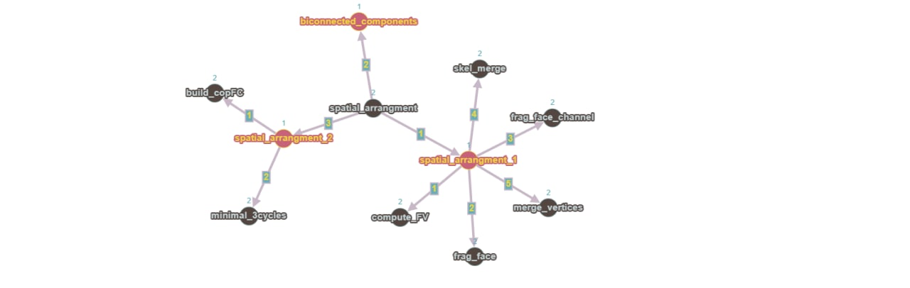

# Funzioni del progetto

Dopo un'attenta analisi del repository  
<https://github.com/cvdlab/LinearAlgebraicRepresentation.jl>, abbiamo  
definito il grafo delle dipendenze relativo al progetto a noi assegnato.  
Il risultato della nostra analisi è la seguente:

Si definiranno ora le funzionalità principali della repository utili ai  
fini dell'algoritmo TGW 3D.

La funzione **spatial arrangment** si occupa di partizionare i complessi  
cellulari, presi in input, con scheletro di dimensione 2 in 3D. Ne segue  
che un complesso cellulare è partizionato quando l'intersezione di  
ogni possibile coppia del complesso risulta vuota e l'unione di  
tutte le celle è tutto lo spazio euclideo. L'output della funzione  
consiste nella partizione complessa rappresentata da una lista di  
vertici V e di una catena di bordi EV, FE, CF.\
\
**spatial arrangment 1**: questa funzione frammenta le facce delle  
figure ai fini dell'utilizzo del arrangment planare. A tal fine usa come  
funzioni di supporto **frag face** e **merge vertices**. Saranno proprio  
questi i metodi che andremmo ad ottimizare.\
1) **frag face**: effettua la trasformazione in 2D delle facce fornite in  
   input tramite il parametro sigma ed infine ogni faccia di questo  
   parametro sigma si interseca con le facce in *sp index*.\
2) **merge vertices**: effettua il merge delle facce vicine, vertici e  
   lati.\
3) **spatial arrangment 2**: ricostruisce le facce dei poligoni permettendo  
   il wrapping in 3D.